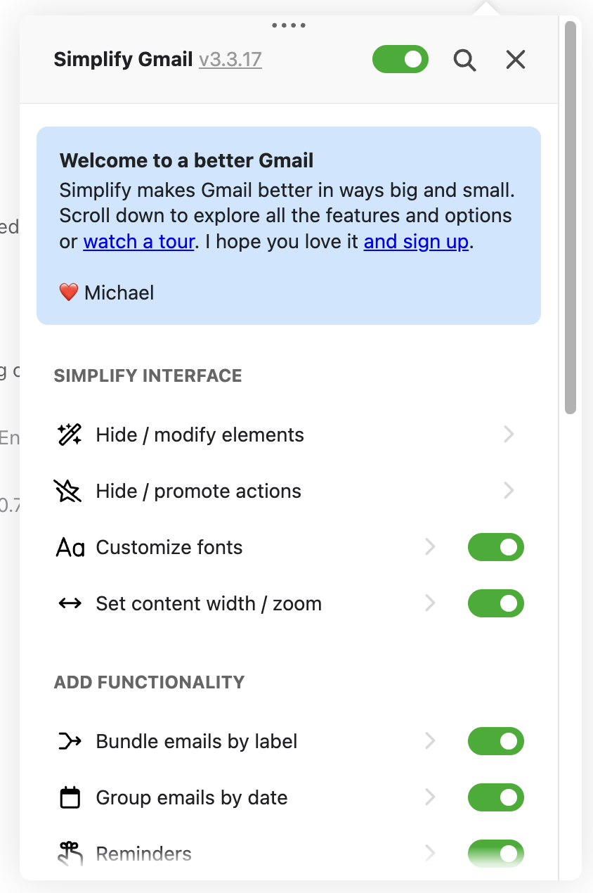

# Improve Appearance Of Speed Controller Settings

**Readiness:** built
Dropped: 2026-02-05 16:41
**Merged into:** `.in/auto-refined/improve appearance of video speed controller settings and all browser extensions.md`

## Auto-investigation
**Investigated:** 2026-02-09

### Findings
The screenshot shows **Simplify Gmail's** settings interface as a design reference, featuring:
- Clean visual hierarchy with section grouping
- Toggle switches for boolean options (green when enabled)
- Icons next to each setting for visual recognition
- Chevron (›) indicators for expandable/detailed settings
- Light grey background with white card-based sections
- Generous spacing and padding
- Clear section headers (e.g., "SIMPLIFY INTERFACE", "ADD FUNCTIONALITY")

**Current Video Speed Controller popup design:**
- **popup.html:1-120** — Structured with sections but no icons or visual grouping cards
- **popup.css:1-301** — Modern design with good typography and spacing
- Uses checkboxes for toggles (not iOS-style toggle switches)
- No icons next to settings
- No expandable/collapsible sections
- Clean but more minimal than the reference screenshot

**Design comparison:**
| Element | Current VSC | Simplify Gmail (reference) |
|---------|-------------|---------------------------|
| Section grouping | Text headers | UPPERCASE headers + cards |
| Boolean controls | Checkboxes | Toggle switches (iOS-style) |
| Icons | None | Icon for each setting |
| Expandable sections | None | Chevron (›) indicators |
| Visual hierarchy | Good | Excellent (icons + grouping) |
| Spacing | Clean | More generous |

**Current strengths:**
- Modern system font stack
- Good colour palette (#0066cc blue, clean greys)
- Accessible focus states
- Smooth transitions and animations
- Clean speed pill design
- Responsive layout

**Potential improvements (inspired by reference):**
1. Add icons to each section/setting for visual scanning
2. Replace checkboxes with iOS-style toggle switches
3. Group sections into card-based containers with subtle shadows
4. Add uppercase section labels with more visual weight
5. Consider collapsible sections for advanced settings
6. Increase padding/spacing for a more spacious feel

### Scope
Medium to large complexity depending on depth of redesign.

Files to modify:
- **popup.css** — Major styling updates for toggle switches, cards, icons, spacing
- **popup.html** — Add icon elements, restructure sections into cards
- **popup.js** — Update event handlers if toggle switches replace checkboxes
- **icons/** — Add new icon assets for settings (gear, keyboard, video, skip icons)

Estimated complexity: **Medium** (primarily CSS/HTML, some JS for toggle switches)

Design decisions needed:
1. Which settings get icons?
2. Should sections be collapsible?
3. iOS-style toggle switches vs current checkboxes?
4. Card-based layout vs current flat design?
5. How much spacing increase is appropriate?

### Questions for refinement
1. Is the goal to match Simplify Gmail's style closely, or just use it as inspiration?
2. Which specific aspects of the reference design are most important (icons, toggles, spacing, cards)?
3. Should the redesign maintain the current compact size (380px width) or expand?
4. Are there any accessibility concerns with toggle switches vs checkboxes?
5. Should this be a gradual improvement or a complete visual overhaul?
6. The task says "Dropped: 2026-02-05 16:41" — does that mean this task is abandoned?

### Dependencies
None. Independent visual design change, no conflicts with other tasks.
